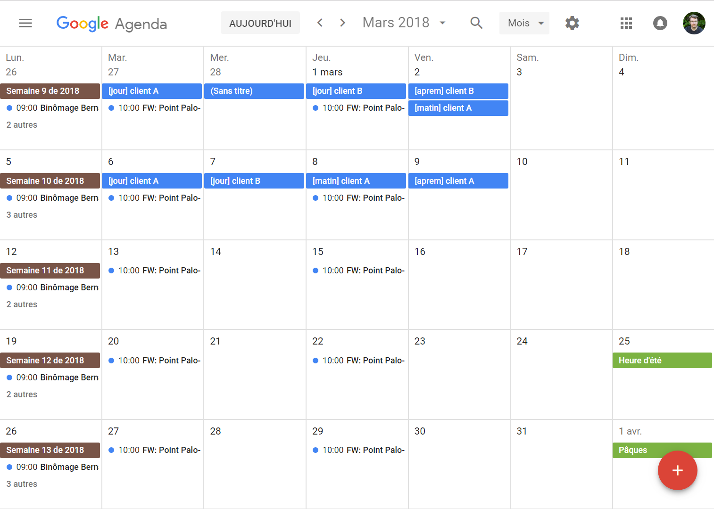

# Kata Marcello

L'objectif de ce kata est de créer un outil pour faciliter la facturation au
temp passé.

En tant que consultant indépendant, je dois compter à la fin du chaque mois le
nombre de jours travaillés pour chaque client et soumettre à chacun d'eux une
facture correspondante. Afin de m'aider à tracer mon activité au jour le
jour, je saisis dans une google calendar des faux évenements indiquant pour quel
client j'ai travaillé ce jour là.

Je crée pour chaque jour un évenement dont le titre est de la forme:

- `[jour] client A`
- `[matin] client A`
- `[aprem] client A`

Il s'agit de créer un utilitaire qui va nous aider à collecter ces
informations. Il doit accomplir les taches suivantes:

- Récupérer les informations du google calendar par une requette https
- Parser les données pour retrouver les évenements qui nous interessent
- Compter le nombre de jours et demi-jounées pour chaque client pour le mois demandé

Le fichier [sample.ics](samle.ics) contient un exemple de données récupérée de
Google Calendar.

En bonus, l'outil pourra aller jusqu'à la création du PDF de la facture.

